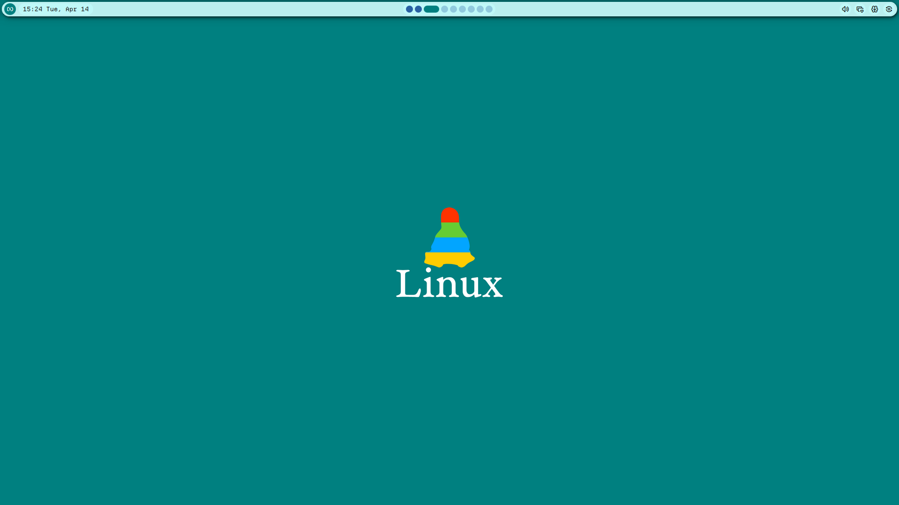

# ClemTheAlien's Wayland Dotfiles
These dotfiles are very similar to my NixOS dotfiles (check those out).

# What Everything is For
* Fastfetch
  * For the fastfetch binary
* Ghostty
  * For the ghostty terminal
* Git
  * For the git binary
* Hypr
  * For the hyprlock binary (will switch the gtklock soon)
* Mango
  * For the MangoWM window manager
* Noctalia
  * For the Noctalia Quickshell shell
* Zed
  * For the Zed IDE
